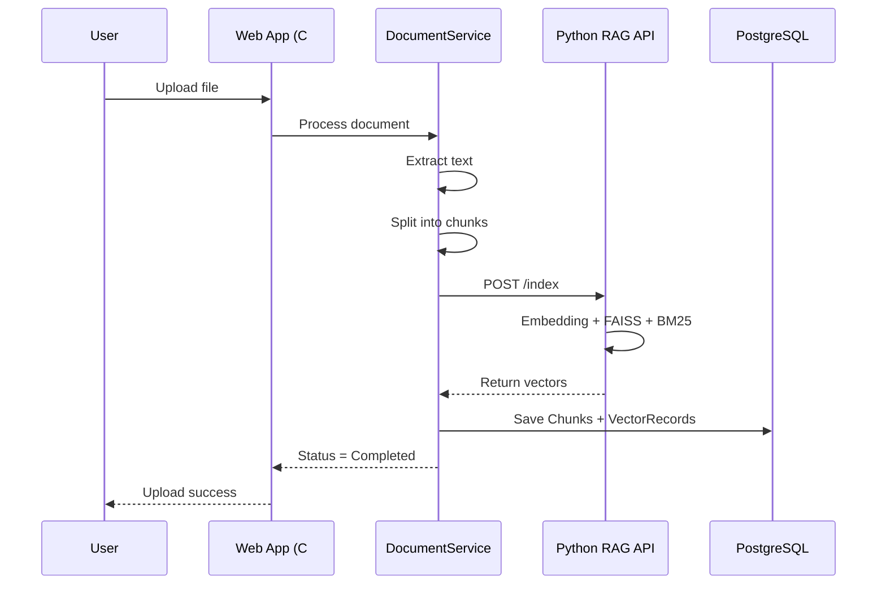

# Luồng nạp tài liệu (Data Ingestion Flow)

Mô tả chi tiết quy trình xử lý tài liệu sau khi người dùng upload. **Chỉ là tài liệu**, không ảnh hưởng runtime.

---

## Tổng quan

```
Upload file → Lưu storage → Trích xuất text → Chunking → Index (Python API) → Lưu DB → Hoàn tất
```

---

## Các bước chi tiết

### Bước 1 — Upload

- Người dùng chọn file qua giao diện web (`DocumentsController`)
- Hệ thống kiểm tra định dạng: `.pdf`, `.docx`, `.txt`
- File được lưu qua `GoogleDriveStorageService` (hoặc storage đã cấu hình)
- Tạo bản ghi `Documents` với trạng thái ban đầu: `Uploaded`

### Bước 2 — Trích xuất văn bản

`DocumentService` xử lý theo loại file:

| Định dạng | Thư viện | Ghi chú |
|---|---|---|
| PDF | PdfPig | Giữ thông tin trang từng đoạn |
| DOCX | OpenXml | Trích xuất paragraph |
| TXT | Đọc file trực tiếp | UTF-8 |

Trạng thái chuyển sang: `Processing`

### Bước 3 — Chunking

Văn bản được chia thành các đoạn nhỏ:

| Tham số | Giá trị |
|---|---|
| Kích thước chunk | 600 ký tự |
| Overlap | 120 ký tự |

Với PDF, số trang của mỗi chunk được xác định bằng thuật toán **`ResolveDominantPage`** — chọn trang chiếm tỷ lệ nội dung lớn nhất trong chunk.

### Bước 4 — Gọi Python RAG API (`POST /index`)

`RagApiClient` gửi danh sách chunks tới Python API:

- Python tính **embedding** (model `all-MiniLM-L6-v2`)
- Cập nhật chỉ mục **FAISS** (semantic)
- Cập nhật chỉ mục **BM25** (lexical)
- Trả về mảng vector cho từng chunk

### Bước 5 — Lưu cơ sở dữ liệu

`DocumentService` lưu đồng thời:

| Bảng | Nội dung |
|---|---|
| `Chunks` | Nội dung, `chunk_index`, `page_number`, metadata |
| `VectorRecords` | Vector embedding, tên model |

Sử dụng **Unit of Work** để đảm bảo tính toàn vẹn transaction.

### Bước 6 — Hoàn tất

- Trạng thái tài liệu: `Completed`
- Nếu lỗi ở bất kỳ bước nào: `Failed`

---

## Sơ đồ luồng



---

## Trạng thái tài liệu (`Documents.status`)

| Trạng thái | Ý nghĩa |
|---|---|
| `Uploaded` | File đã nhận, chờ xử lý |
| `Processing` | Đang trích xuất / chunking / indexing |
| `Completed` | Sẵn sàng dùng cho chat |
| `Failed` | Lỗi trong quá trình xử lý |
| `Reingesting` | Đang xử lý lại tài liệu |

---

## Điểm lỗi thường gặp

| Bước | Nguyên nhân | Triệu chứng |
|---|---|---|
| Upload | File không đúng định dạng | Lỗi ngay trên UI |
| Extract | PDF scan ảnh, không có text | Chunk rỗng → `Failed` |
| Index | Python API không chạy | Kẹt `Processing` |
| Index | Timeout embedding | `Failed` sau thời gian chờ |
| Save DB | Lỗi migration / connection | Exception, `Failed` |

---

## Tài liệu liên quan

- [Kiến trúc hệ thống](System_Architecture_Summary.md)
- [ERD — bảng Documents, Chunks, VectorRecords](ERD_RAG_Chatbot_Explanation.md)
- [FAQ](FAQ.md)
- [Biến môi trường](EnvironmentVariables.md)
