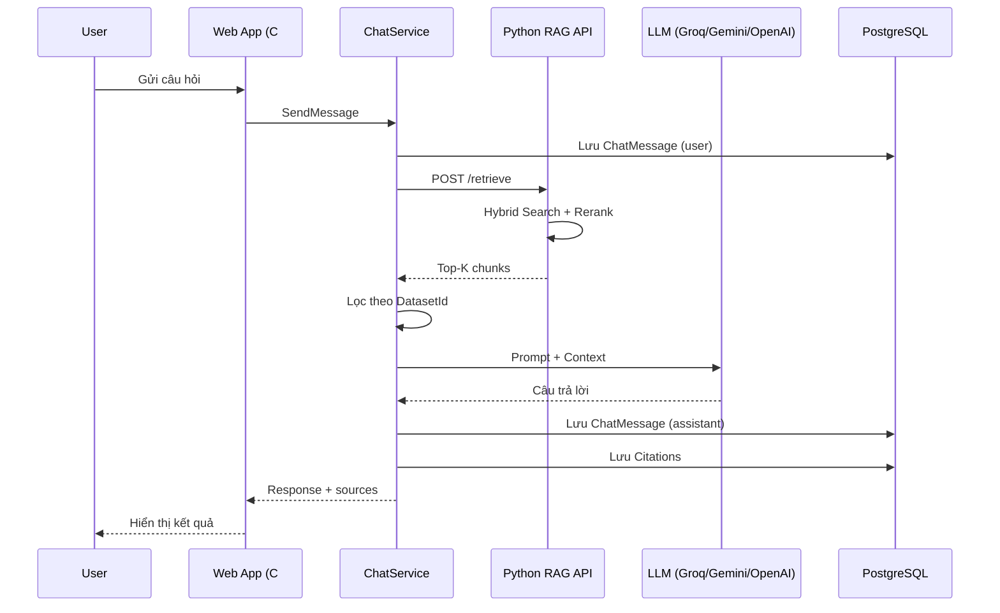

# Luồng hỏi đáp (Query & Answer Flow)

Mô tả chi tiết quy trình từ khi người dùng gửi câu hỏi đến khi nhận câu trả lời kèm trích dẫn. **Chỉ là tài liệu**, không ảnh hưởng runtime.

---

## Tổng quan

```
Câu hỏi → Lưu tin nhắn → Retrieval (Python API) → Lọc theo Dataset → Gọi LLM → Lưu trả lời + Citations → Hiển thị
```

---

## Các bước chi tiết

### Bước 1 — Người dùng gửi câu hỏi

- Thao tác trên giao diện chat trong một `ChatSession`
- `ChatSessionsController` nhận request qua action `SendMessage`
- Mỗi session gắn với một `DatasetId` — giới hạn phạm vi tìm kiếm

### Bước 2 — Lưu tin nhắn người dùng

`ChatService` lưu vào bảng `ChatMessages`:

| Trường | Giá trị |
|---|---|
| `role` | `user` |
| `content` | Nội dung câu hỏi |
| `session_id` | Phiên chat hiện tại |

### Bước 3 — Retrieval qua Python API (`POST /retrieve`)

`RagApiClient` gửi câu hỏi tới Python RAG API. Pipeline retrieval:

1. **Embedding** câu hỏi
2. **FAISS** — tìm kiếm ngữ nghĩa (semantic)
3. **BM25** — tìm kiếm từ khóa (lexical)
4. **RRF** — hợp nhất kết quả hai chỉ mục
5. **Cross-Encoder Reranker** — sắp xếp lại top ứng viên

Trả về danh sách chunks liên quan kèm metadata và điểm số.

### Bước 4 — Lọc theo Dataset

`ChatService` chỉ giữ các chunk thuộc tài liệu trong **dataset của phiên chat** — tránh trả lời dựa trên tài liệu không được phép truy cập.

### Bước 5 — Xây dựng prompt & gọi LLM

Các đoạn ngữ cảnh được nối thành **Context**, kết hợp với câu hỏi trong prompt:

- Yêu cầu trả lời **chỉ dựa trên ngữ cảnh** đã cung cấp
- Nếu không có thông tin phù hợp → trả lời: *"Tôi không tìm thấy thông tin này trong tài liệu của bạn."*

LLM được gọi qua `GroqService` / `OpenAiService` / `LlmService` (Gemini).

**Fallback:** Nếu LLM lỗi hoặc thiếu API key → trả về nội dung ngữ cảnh trực tiếp.

### Bước 6 — Lưu câu trả lời

Lưu vào `ChatMessages` với `role = assistant`.

### Bước 7 — Tạo Citations

Từ metadata các chunk đã dùng làm ngữ cảnh, tạo bản ghi `Citations`:

| Trường | Nội dung |
|---|---|
| `document_id` | Tài liệu gốc |
| `chunk_id` | Đoạn được trích dẫn |
| `page_number` | Số trang |
| `quote_text` | Đoạn nội dung nguồn |
| `source_label` | Nhãn hiển thị (tên file, v.v.) |

### Bước 8 — Trả kết quả lên UI

Người dùng nhận câu trả lời AI kèm danh sách nguồn trích dẫn để kiểm chứng.

---

## Sơ đồ luồng



---

## Bảng dữ liệu liên quan

| Bước | Bảng |
|---|---|
| Phiên chat | `ChatSessions` |
| Tin nhắn | `ChatMessages` |
| Chunk ngữ cảnh | `Chunks` |
| Vector (retrieval) | `VectorRecords` |
| Nguồn trích dẫn | `Citations` |
| Tài liệu gốc | `Documents` |

---

## Điểm lỗi thường gặp

| Triệu chứng | Nguyên nhân có thể |
|---|---|
| Trả lời "không tìm thấy thông tin" | Câu hỏi ngoài phạm vi tài liệu hoặc retrieval không khớp |
| Không có citation | Không có chunk nào vượt ngưỡng relevance |
| Trả lời chậm | Reranker + LLM — bình thường vài giây đến vài chục giây |
| Lỗi timeout | Python API hoặc LLM không phản hồi kịp (timeout 60–120s) |
| Chỉ hiện ngữ cảnh thô | LLM fallback đang hoạt động |

---

## Tài liệu liên quan

- [Luồng nạp tài liệu](DataIngestionFlow.md)
- [Kiến trúc hệ thống](System_Architecture_Summary.md)
- [Thuật ngữ — RAG, Hybrid Search](Glossary.md)
- [FAQ](FAQ.md)
